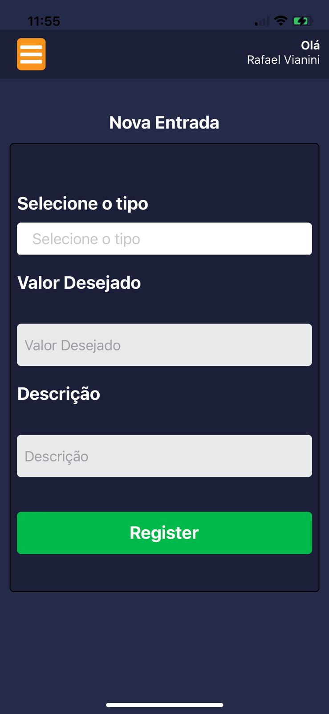
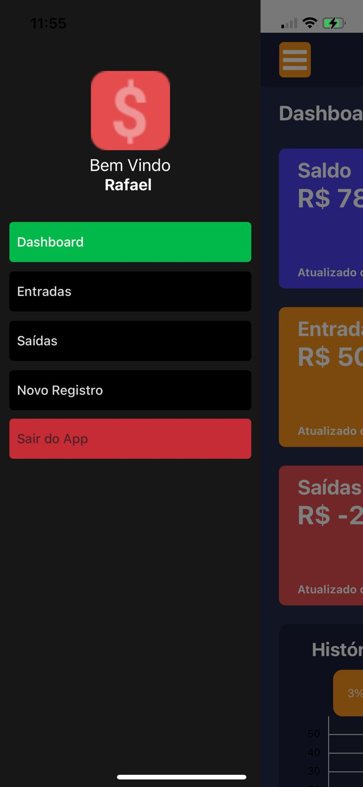
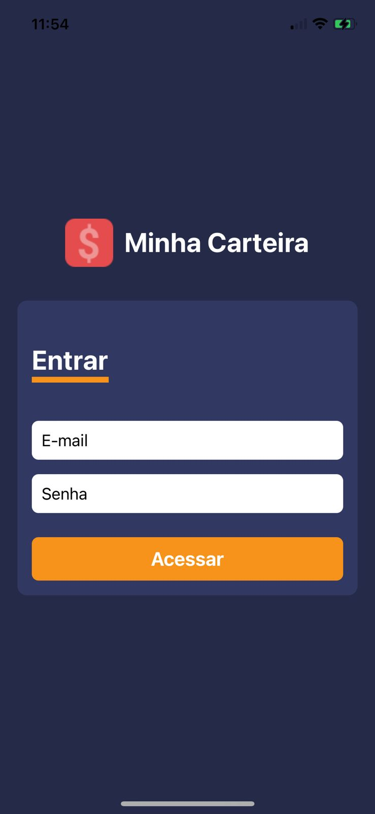
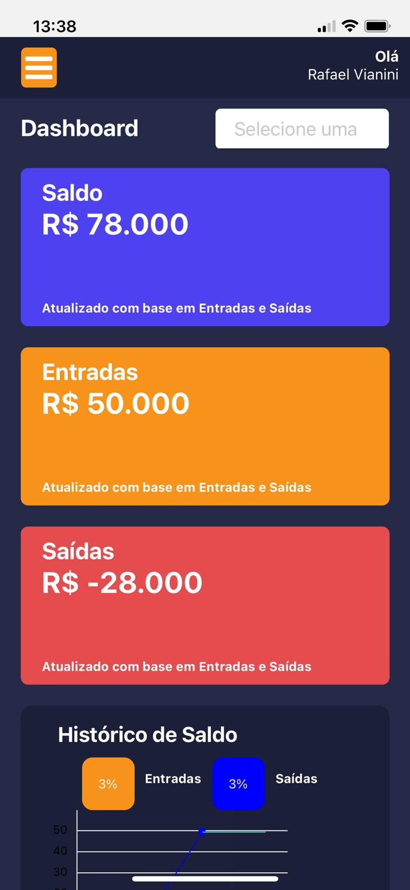

## Aplicativo Finanças

 - Aplicativo desenvolvido para estudo com acesso a uma API em typescript com nestjs e arquitetura limpa.
 - Foi utilizado react-native, docker e expo.

## Requires

 - node
 - npm
 - git
 - vscode
 - Docker
 - e muito Café =D

## Aplicativo.

 - Algumas imagens do aplicativo funcionando.
 - Foi utilizado o conceito da navegação com Drawer.
 - Cutomizado a parte do menu.

